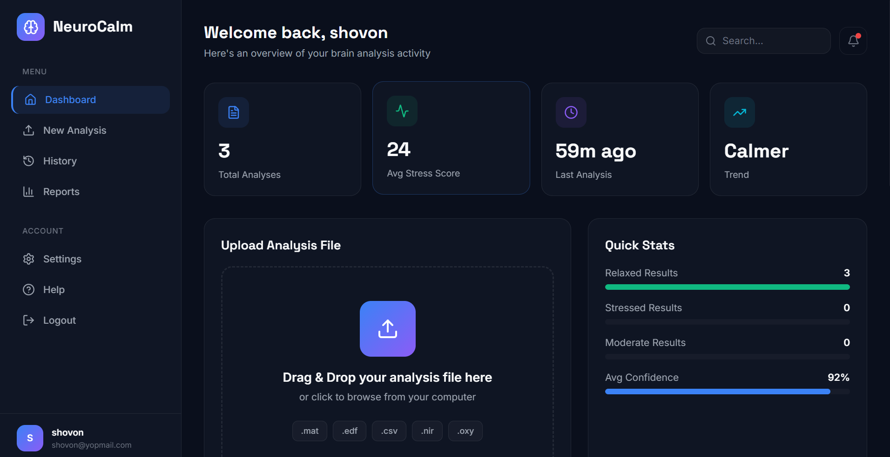
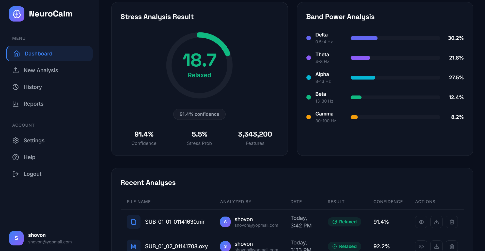
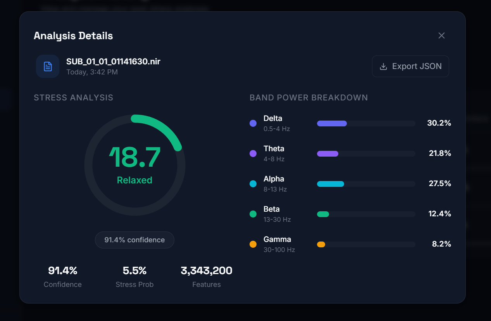
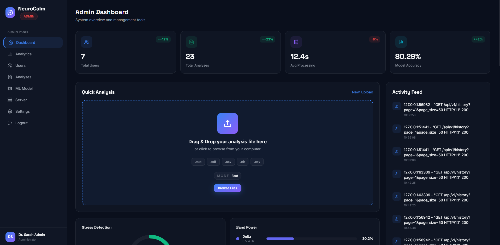

# NeuroCalm

<div align="center">


**A modern full-stack platform for fNIRS cognitive workload analysis**

Upload data, run model inference, inspect reports, manage users, and switch between mock/demo mode and live backend mode from the same product.

</div>

---

## ✨ What This Project Includes

NeuroCalm currently includes:

- 🖥️ A React + Vite frontend in `neurocalm-frontend`
- ⚙️ A FastAPI backend in `neurocalm-backend`
- 🗄️ PostgreSQL persistence
- 🧠 A deployed SALIENT-style model, scaler, and metadata in `model`
- 🧪 Raw and prepared dataset assets in `TestData`, `dataset`, `lite`, and `fNIRS-mental-workload-classifiers`
- 🔐 Email/password login plus Google, GitHub, and Microsoft OAuth
- 👤 User dashboard, uploads, history, reports, and settings
- 🛠️ Admin dashboard, users, analyses, analytics, server, model, and system settings
- 🎭 A frontend-wide mock/live toggle
- 📈 Real model inference for model-ready CSV input
- 🧬 An experimental raw-data preprocessing path for `.nir`, `.oxy`, and fnirSoft exports

---

## 📸 UI Preview

<div align="center">
  
  
</div>

<div align="center">
  
  
</div>

---

## 🧱 Project Structure

```text
NeuroCalm/
├── neurocalm-frontend/                 # React frontend
├── neurocalm-backend/                  # FastAPI backend
├── model/                              # deployed model, scaler, metadata, evaluation artifact
├── TestData/                           # raw fNIRS test sessions
├── dataset/                            # prepared sliding-window training data
├── fNIRS-mental-workload-classifiers/  # Tufts reference repo copy
├── lite/                               # training notebook assets
├── docs/                               # notes, specs, and project docs
├── screenshots/                        # UI screenshots
└── README.md
```

---

## 🚀 Current Tech Stack

| Layer | Stack |
|-------|-------|
| Frontend | React 19, Vite, Tailwind CSS, Zustand, Framer Motion |
| Backend | FastAPI, SQLAlchemy, asyncpg, Pydantic Settings |
| Database | PostgreSQL |
| ML | TensorFlow CPU, scikit-learn, pandas, NumPy, SciPy |
| Auth | JWT + Google/GitHub/Microsoft OAuth |

---

## 🧩 Core Features

### 👤 User Experience

- Secure login and registration
- Social sign-in with Google, GitHub, and Microsoft
- File upload and workload analysis flow
- Staged "thinking" progress experience during analysis
- History search and filter tools
- JSON and PDF report export
- Settings page with profile, notification, and password flows

### 🛠️ Admin Experience

- Dashboard overview
- User management with add-user flow
- Soft delete behavior through `is_active = false`
- Analysis monitoring
- Analytics and server status
- Model page with live metadata and subject evaluation scores
- System settings controls

### 🧠 ML / Data

- SALIENT-style deployed model files included in the repo
- Prepared training-style sliding-window dataset available
- Experimental preprocessing bridge for raw fNIRS exports
- CLI preprocessing support for test sessions

---

## ⚡ Quick Start

### 1. Start the backend

Recommended Python version on this machine: `3.12`

```powershell
cd C:\Users\BS01685.BS-01685\NeuroCalm\neurocalm-backend
py -3.12 -m venv .venv
.\.venv\Scripts\Activate.ps1
python -m pip install --upgrade pip
pip install -r requirements.txt
```

If you want real model inference:

```powershell
pip install -r requirements-ml.txt
```

Create the env file:

```powershell
Copy-Item .env.example .env
```

Minimum env values:

```env
POSTGRES_HOST=localhost
POSTGRES_PORT=5432
POSTGRES_DB=neurocalm
POSTGRES_USER=postgres
POSTGRES_PASSWORD=your-password
SECRET_KEY=put-a-long-random-secret-here
FRONTEND_URL=http://localhost:5173
CORS_ORIGINS=http://localhost:5173,http://localhost:3000
```

For real model mode, keep:

```env
MODEL_PATH=model/SALIENT_model.h5
MODEL_TYPE=SALIENT
SCALER_PATH=model/SALIENT_scaler.pkl
MODEL_METADATA_PATH=model/deploy_metadata.json
```

Seed and run:

```powershell
python seed.py
uvicorn app.main:app --reload
```

Backend URLs:

- `http://127.0.0.1:8000/`
- `http://127.0.0.1:8000/health`
- `http://127.0.0.1:8000/docs`

### 2. Start the frontend

```powershell
cd C:\Users\BS01685.BS-01685\NeuroCalm\neurocalm-frontend
npm install
npm run dev
```

Frontend env:

```env
VITE_API_URL=http://localhost:8000/api/v1
VITE_APP_NAME=NeuroCalm
```

Frontend URL:

- `http://localhost:5173`

---

## 🎭 Mock Mode vs Live Mode

The frontend can switch between demo/mock data and the real backend.

Edit:

- `neurocalm-frontend/src/config/appConfig.js`

Set:

```js
useMockDataEnabled: false
```

- `true` → mock auth, mock analyses, mock admin data
- `false` → real API calls to the FastAPI backend

This toggle is wired across:

- auth
- upload and analysis
- history and reports
- admin pages

---

## 🔐 Authentication

Supported auth flows:

- Email/password
- Google OAuth
- GitHub OAuth
- Microsoft OAuth

Backend OAuth env fields:

```env
GOOGLE_CLIENT_ID=
GOOGLE_CLIENT_SECRET=
GITHUB_CLIENT_ID=
GITHUB_CLIENT_SECRET=
MICROSOFT_CLIENT_ID=
MICROSOFT_CLIENT_SECRET=
MICROSOFT_TENANT_ID=common
```

Local backend callback URLs:

- `http://localhost:8000/api/v1/auth/oauth/google/callback`
- `http://localhost:8000/api/v1/auth/oauth/github/callback`
- `http://localhost:8000/api/v1/auth/oauth/microsoft/callback`

Frontend callback route:

- `http://localhost:5173/oauth/callback`

---

## 🧠 Model and Data

### Deployed model assets

The deployed model files live in `model/`:

- `SALIENT_model.h5`
- `SALIENT_scaler.pkl`
- `deploy_metadata.json`
- `results_30sec_150ts.pkl`

### Training-style prepared data

The training-style windowed data is under:

- `dataset/slide_window_data/size_30sec_150ts_stride_03ts`

Expected model feature columns:

```text
AB_I_O, AB_PHI_O, AB_I_DO, AB_PHI_DO,
CD_I_O, CD_PHI_O, CD_I_DO, CD_PHI_DO
```

### Raw test data

Raw sessions are under:

- `TestData/`

The backend currently supports two data paths:

1. ✅ Exact model-ready CSV path
   Already prepared 8-column CSV files can be windowed and predicted directly.

2. ⚠️ Experimental raw-data path
   Raw `.nir`, `.oxy`, and fnirSoft exports can be run through the backend's assumption-based preprocessing bridge.

Important:
The raw-data compatibility path is runnable, but it is still an approximation of the original Tufts upstream feature-generation step.

### CLI preprocessing

From `neurocalm-backend`:

```powershell
python preprocess_model_input.py "..\TestData\Subject 01"
```

Inspection-only mode:

```powershell
python preprocess_model_input.py "..\TestData" --report-only
```

---

## 📡 API Overview

Main API groups:

- `/api/v1/auth`
- `/api/v1/users`
- `/api/v1/analysis`
- `/api/v1/history`
- `/api/v1/reports`
- `/api/v1/admin`

Swagger docs:

- `http://localhost:8000/docs`

---

## 📝 Important Notes

- Uploaded files are stored locally in the backend `uploads` directory.
- Deleting an analysis removes its stored file from disk.
- Deactivating a user is a soft delete, not a physical row delete.
- Confidence shown to users is presentation-adjusted into the low 90s minimum range.
- In mock mode, social login buttons show beta messaging; in live mode they use the real OAuth flow.

---

## 🌍 Free Deployment Recommendation

The easiest free setup for this repo is:

1. **Frontend:** Vercel
2. **Backend:** Render
3. **Database:** Neon

### Deployment flow

1. Push the repo to GitHub
2. Create a Neon PostgreSQL database
3. Deploy `neurocalm-backend` to Render
4. Add Render env vars:
   - `DATABASE_URL`
   - `SECRET_KEY`
   - `FRONTEND_URL`
   - `CORS_ORIGINS`
   - model paths
5. Deploy `neurocalm-frontend` to Vercel
6. Set `VITE_API_URL` in Vercel to your Render backend URL + `/api/v1`
7. Update OAuth provider callback URLs to production backend URLs
8. Seed the production database once

### Free-tier caveats

- Render free services sleep after idle time
- Render filesystem is ephemeral, so uploads are not durable storage
- TensorFlow cold starts can be slow on free infrastructure

---

## 📚 Extra Reference Files

- `neurocalm-backend/README.md`
- `neurocalm-frontend/README.md`
- `deploy.md`
- `docs/testdata_to_salient_mapping_spec.md`
- `fNIRS-mental-workload-classifiers/`

---

## 📄 License

This project is licensed under the MIT License. See `LICENSE`.
