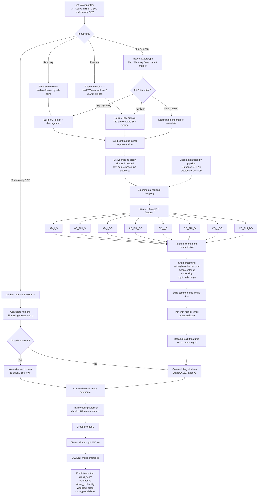

# TestData To Model Preprocessing Flow

Readable HTML version: [diagram-readable.html](./diagram-readable.html)

Downloadable Mermaid source: [diagram.mmd](./diagram.mmd)

```mermaid
flowchart TD
    A["TestData input files<br/>.nir / .oxy / fnirSoft CSV / model-ready CSV"]
    A --> B{"Input type?"}

    B -->|"Model-ready CSV"| C["Validate required 8 columns"]
    C --> D["Convert to numeric<br/>fill missing values with 0"]
    D --> E{"Already chunked?"}
    E -->|"Yes"| F["Normalize each chunk<br/>to exactly 150 rows"]
    E -->|"No"| G["Create sliding windows<br/>window=150, stride=3"]

    B -->|"Raw .oxy"| H["Read time column<br/>read oxy/deoxy optode pairs"]
    B -->|"Raw .nir"| I["Read time column<br/>read 730nm / ambient / 850nm triplets"]
    B -->|"fnirSoft CSV"| J["Inspect export type<br/>hbo / hbr / oxy / raw / time / marker"]

    H --> K["Build oxy_matrix + deoxy_matrix"]
    I --> L["Correct light signals<br/>730-ambient and 850-ambient"]
    J --> M{"fnirSoft content?"}
    M -->|"hbo / hbr / oxy"| K
    M -->|"raw light"| L
    M -->|"time / marker"| N["Load timing and marker metadata"]

    K --> O["Build continuous signal representation"]
    L --> O
    N --> O

    O --> P["Derive missing proxy signals if needed<br/>oxy, deoxy, phase-like gradients"]
    P --> Q["Experimental regional mapping"]
    R["Assumption used by pipeline<br/>Optodes 1..8 = AB<br/>Optodes 9..16 = CD"] -.-> Q

    Q --> S["Create Tufts-style 8 features"]
    S --> S1["AB_I_O"]
    S --> S2["AB_PHI_O"]
    S --> S3["AB_I_DO"]
    S --> S4["AB_PHI_DO"]
    S --> S5["CD_I_O"]
    S --> S6["CD_PHI_O"]
    S --> S7["CD_I_DO"]
    S --> S8["CD_PHI_DO"]

    S1 --> T["Feature cleanup and normalization"]
    S2 --> T
    S3 --> T
    S4 --> T
    S5 --> T
    S6 --> T
    S7 --> T
    S8 --> T

    T --> U["Short smoothing<br/>rolling baseline removal<br/>mean centering<br/>std scaling<br/>clip to safe range"]
    U --> V["Build common time grid at 5 Hz"]
    V --> W["Trim with marker times when available"]
    W --> X["Resample all 8 features onto common grid"]

    F --> Y["Chunked model-ready dataframe"]
    G --> Y
    X --> G

    Y --> Z["Final model input format<br/>chunk + 8 feature columns"]
    Z --> AA["Group by chunk"]
    AA --> AB["Tensor shape = (N, 150, 8)"]
    AB --> AC["SALIENT model inference"]
    AC --> AD["Prediction output<br/>stress_score<br/>confidence<br/>stress_probability<br/>workload_class<br/>class_probabilities"]
```
